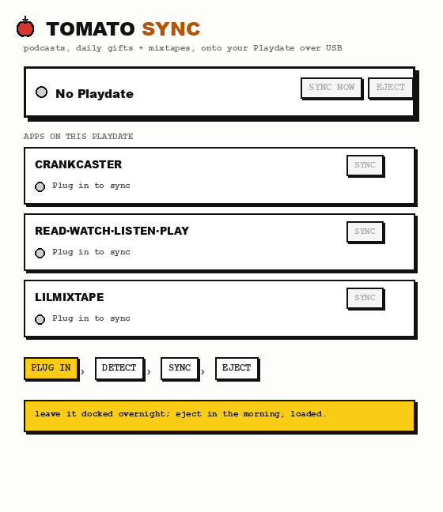

# 🍅 Tomato Sync

> Your Playdate apps, fed overnight. Plug in, it syncs, you wake up loaded.

**Tomato Sync** is a little desktop companion for your Playdate, the way iTunes used
to sync an iPod. Plug your Playdate in, and Tomato Sync notices which jontomato apps
you have and quietly fills them with fresh stuff over USB. No menus, no fiddling.

Leave it docked overnight and wake up to new episodes, today's gift, and your latest
mixtape, already on the device. It even keeps the apps themselves up to date.



## What it feeds

- **[Crankcaster](https://jontomato.itch.io/crankcaster)** is your podcasts. It pulls
  the newest unplayed episodes for every show in your stack and trims what you've
  finished.
- **[Read Watch Listen Play](https://jontomato.itch.io/read-watch-listen-play)** is the
  daily four-pillar gift: a story, a short film, a radio play, a crossword. It grabs
  today's and clears out yesterday's.
- **[lilmixtape](https://jontomato.itch.io/lilmixtape)** is your current mixtape's
  tracks, ready to play offline.

You install those on your Playdate from their own itch pages (links above). Tomato
Sync just keeps them fed.

## Download

Grab the latest from **[Releases](../../releases/latest)**:

| Your computer | File |
|---|---|
| 🍎 **macOS** (Apple Silicon) | `Tomato-Sync-…-arm64.dmg` |
| 🪟 **Windows 10/11** (alpha) | `Tomato-Sync-Setup-….exe` |

### Install

- **macOS:** open the `.dmg` and drag **Tomato Sync** to Applications. First launch
  only: right-click the app, choose **Open**, then **Open** again (it's unsigned, so a
  normal double-click gets blocked the first time). It lives in your **menu bar** as a
  little tomato.
- **Windows (alpha):** run the installer. If SmartScreen warns, click **More info**,
  then **Run anyway**. It lives in your **system tray**. ⚠️ The Windows build hasn't
  been tested on real hardware yet, so treat it as experimental.

## How to use

1. **Wake your Playdate** (press the lock button) and plug it in over USB. It has to be
   awake for the sync to start.
2. Tomato Sync detects your apps and syncs each one. Open the window for a card per
   app, each with a **Sync** button and a link to manage it on the web.
3. Leave it **docked overnight** and it keeps pulling new stuff on a timer.
4. Hit **Eject** in the morning, then unplug. Always eject before unplugging.

It also **auto-updates the Playdate apps** to their latest build before each sync, so
you stay current without re-sideloading.

---

## Run / build from source

```bash
npm install
npm start                 # the menu-bar app
node src/sync.mjs --dry   # CLI: show what every detected app would do
npm run dist:mac          # build a .dmg  (npm run dist:win for Windows)
```

Or push a `v*` tag and the GitHub Action (`.github/workflows/release.yml`) builds the
macOS and Windows installers and attaches them to a release.

> Note: service endpoints live in `src/endpoints.local.mjs`, which is untracked. Copy
> the keys from `src/endpoints.mjs` into your own local file to build a working app.

## How it works

- Sends `datadisk` to the Playdate's serial port to enter data-disk mode (no menu),
  writes into each app's `Data/<bundle-id>/`, updates the `.pdx` in `Games/`, ejects.
- The Playdate must be awake. Its serial port disappears when it sleeps.
- Stays **docked** overnight: mounts once, re-syncs on a timer without ejecting (which
  would reboot it), and keeps the Mac awake.

Each app is a small **adapter** (`src/adapters/*`) exposing `detect()` and `sync()`.
The shared shell (`src/core.mjs` transport, `src/engine.mjs` orchestrator) loops over
the apps it finds. Adding a new app is one new adapter file.

```
src/core.mjs            cross-platform USB transport (find port, mount/eject, fetch)
src/updater.mjs         app auto-update (installed pdxinfo build vs a manifest)
src/adapters/*.mjs      one per app: crankcaster, rwlp, lilmixtape
src/engine.mjs          orchestrator: update apps, then sync each detected one
electron/               tray + window (per-app cards, brutalist brand)
scripts/publish-pdx.mjs package + publish an app update
```

## Publishing a Playdate-app update

Tomato Sync checks a version manifest and swaps in a newer `.pdx` before syncing. To
ship an app update: bump `buildNumber` in the app's `pdxinfo`, recompile, then:

```bash
node scripts/publish-pdx.mjs ~/path/to/App.pdx --upload --bucket <your-bucket>
```

That zips the `.pdx`, bumps the manifest, and uploads both. The manifest shape:

```json
{ "com.jontomato.example": { "version": "1.0", "build": 10, "pdx": "example.b10.pdx.zip" } }
```

## Platforms

- **macOS** is supported and proven on hardware. (Release builds are Apple Silicon. An
  Intel or universal target can be added when needed.)
- **Windows is ALPHA and untested.** The transport is implemented (PowerShell for
  serial, drive, and eject) but has never run on real Windows hardware. Three things to
  verify: COM-port detection, the eject verb, and the tray icon.
- Linux builds an AppImage, but the device transport isn't implemented.

---

Made by **jontomato**. Free.
