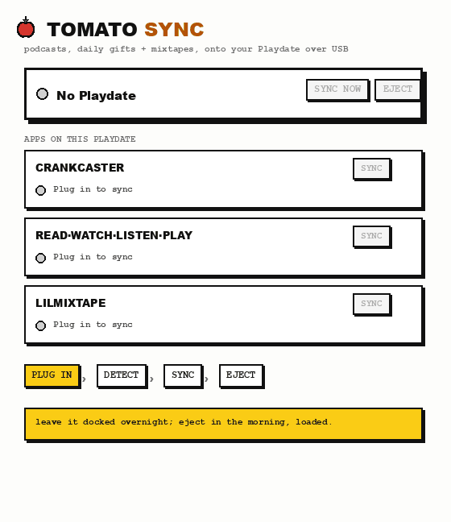

# 🍅 Tomato Sync

> Your Playdate apps, fed overnight. Plug in, it syncs, you wake up loaded.

**Tomato Sync** is a little desktop companion for your Playdate, the way iTunes used
to sync an iPod. Plug your Playdate in, and Tomato Sync notices which jontomato apps
you have and quietly fills them with fresh stuff over USB. No menus, no fiddling.

Leave it docked overnight and wake up to new episodes, today's gift, and your latest
mixtape, already on the device. It even keeps the apps themselves up to date.



## What it feeds

- **[Crankcaster](https://jontomato.itch.io/crankcaster)** is your podcasts. It pulls
  the newest unplayed episodes for every show in your stack and trims what you've
  finished.
- **[Read Watch Listen Play](https://jontomato.itch.io/read-watch-listen-play)** is the
  daily four-pillar gift: a story, a short film, a radio play, a crossword. It grabs
  today's and clears out yesterday's.
- **[lilmixtape](https://jontomato.itch.io/lilmixtape)** is your current mixtape's
  tracks, ready to play offline.
- **[Pour Over](https://jontomato.itch.io/pour-over)** is slow NPR listening —
  top-of-the-hour news, Tiny Desk, and station live streams. It streams on demand, so
  there's nothing to pre-load; Tomato Sync just keeps its app build current.
- **[footnotes](https://jontomato.itch.io/footnotes)** is the pedometer. All step data
  stays on your Playdate (private by design), so there's nothing to sync — Tomato Sync
  only keeps its app build current.

You install those on your Playdate from their own itch pages (links above). Tomato
Sync just keeps them fed and up to date.

## Download

Grab the latest from **[Releases](../../releases/latest)**:

| Your computer | File |
|---|---|
| 🍎 **macOS** (Apple Silicon) | `Tomato-Sync-…-arm64.dmg` |
| 🪟 **Windows 10/11** (alpha) | `Tomato-Sync-Setup-….exe` |

### Install

- **macOS:** open the `.dmg` and drag **Tomato Sync** to Applications. It lives in your
  **menu bar** as a little tomato. Because the app isn't signed with an Apple Developer
  certificate, macOS blocks it the first time — see **"macOS won't open it"** just below.
- **Windows (alpha):** run the installer. If SmartScreen warns, click **More info**,
  then **Run anyway**. It lives in your **system tray**. ⚠️ The Windows build hasn't
  been tested on real hardware yet, so treat it as experimental.

### macOS won't open it (unsigned-app quarantine)

Tomato Sync isn't notarized by Apple, so when you download it macOS attaches a
"quarantine" flag. Depending on your macOS version you'll see one of these:

- **"Tomato Sync is damaged and can't be opened. You should move it to the Trash."**
- **"Tomato Sync can't be opened because Apple cannot check it for malicious software."**
- **"…can't be opened because it is from an unidentified developer."**

None of these mean the app is actually broken — it's just the quarantine flag. Clear it
once with Terminal (paste this and press Return):

```bash
xattr -dr com.apple.quarantine "/Applications/Tomato Sync.app"
```

Then open the app normally. If you dragged it somewhere other than Applications, point
that path at wherever the `.app` actually is. (On older macOS you can instead
**right-click the app → Open → Open**, but the `xattr` command works on every version,
including the "damaged" case where right-click-Open does nothing.)

Still stuck? Belt-and-suspenders — clear every extended attribute, then re-sign it
locally with an ad-hoc signature:

```bash
xattr -cr "/Applications/Tomato Sync.app"
codesign --force --deep --sign - "/Applications/Tomato Sync.app"
```

## How to use

1. **Wake your Playdate** (press the lock button) and plug it in over USB. It has to be
   awake for the sync to start.
2. Tomato Sync detects your apps and syncs each one. Open the window for a card per
   app, each with a **Sync** button and a link to manage it on the web.
3. Leave it **docked overnight** and it keeps pulling new stuff on a timer.
4. Hit **Eject** in the morning, then unplug. Always eject before unplugging.

It also **auto-updates the Playdate apps** to their latest build before each sync, so
you stay current without re-sideloading.

---

## Run / build from source

```bash
npm install
npm start                 # the menu-bar app
node src/sync.mjs --dry   # CLI: show what every detected app would do
npm run dist:mac          # build a .dmg  (npm run dist:win for Windows)
```

Or push a `v*` tag and the GitHub Action (`.github/workflows/release.yml`) builds the
macOS and Windows installers and attaches them to a release.

> Note: service endpoints live in `src/endpoints.local.mjs`, which is untracked. Copy
> the keys from `src/endpoints.mjs` into your own local file to build a working app.

## How it works

- Sends `datadisk` to the Playdate's serial port to enter data-disk mode (no menu),
  writes into each app's `Data/<bundle-id>/`, updates the `.pdx` in `Games/`, ejects.
- The Playdate must be awake. Its serial port disappears when it sleeps.
- Stays **docked** overnight: mounts once, re-syncs on a timer without ejecting (which
  would reboot it), and keeps the Mac awake.

Each app is a small **adapter** (`src/adapters/*`) exposing `detect()` and `sync()`.
The shared shell (`src/core.mjs` transport, `src/engine.mjs` orchestrator) loops over
the apps it finds. Adding a new app is one new adapter file.

```
src/core.mjs            cross-platform USB transport (find port, mount/eject, fetch)
src/updater.mjs         app auto-update (installed pdxinfo build vs a manifest)
src/adapters/*.mjs      one per app: crankcaster, rwlp, lilmixtape, footnotes, pourover
src/engine.mjs          orchestrator: update apps, then sync each detected one
electron/               tray + window (per-app cards, brutalist brand)
scripts/publish-pdx.mjs package + publish an app update
```

## Publishing a Playdate-app update

Tomato Sync checks a version manifest and swaps in a newer `.pdx` before syncing. To
ship an app update: bump `buildNumber` in the app's `pdxinfo`, recompile, then publish.

⚠️ **Seed the local manifest from R2 first.** `publish-pdx.mjs` *merges* into a local
`dist-apps/apps.json`; if that file is missing or stale it will drop the OTHER apps'
update entries when you upload. Always pull the live manifest before publishing:

```bash
mkdir -p dist-apps
rclone copyto r2:readwatchlistenplay/apps.json dist-apps/apps.json   # seed from live
node scripts/publish-pdx.mjs ~/path/to/App.pdx                       # merge this app in
rclone copy dist-apps r2:readwatchlistenplay/ --s3-no-check-bucket   # upload zip + manifest
```

(`apps.json` and the app zips live in the `readwatchlistenplay` R2 bucket.) The
`--upload --bucket <name>` flag does the upload for you, but only for the one app; the
seed-then-copy flow above is safest when several apps ship together. Manifest shape:

```json
{ "com.jontomato.example": { "version": "1.0", "build": 10, "pdx": "example.b10.pdx.zip" } }
```

## Platforms

- **macOS** is supported and proven on hardware. (Release builds are Apple Silicon. An
  Intel or universal target can be added when needed.)
- **Windows is ALPHA and untested.** The transport is implemented (PowerShell for
  serial, drive, and eject) but has never run on real Windows hardware. Three things to
  verify: COM-port detection, the eject verb, and the tray icon.
- Linux builds an AppImage, but the device transport isn't implemented.

---

Made by **jontomato**. Free.
